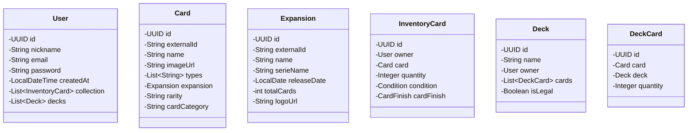

<div align="center">
  
  <h1>⚡ SilphEngine</h1>
  <p><strong>A High-Performance TCG Management & Validation Engine</strong></p>

  [](https://openjdk.org/)
  [](https://spring.io/projects/spring-boot)
  [](https://www.postgresql.org/)
  [](https://opensource.org/licenses/MIT)
</div>

---

## 📖 The Vision

Most TCG applications are basic CRUD systems. **SilphEngine** is architected as a **Logic Hub**. It bridges the gap between raw metadata (TCGdex API) and competitive play requirements. 

Whether you are a collector tracking the "mintiness" of a rare card or a player testing deck legality, SilphEngine provides the architectural backbone to handle complex domain rules with millisecond precision.

---

## 🏛️ Engineering & Design Philosophy

As a developer focused on high-performance systems, I built SilphEngine with a focus on **data integrity** and **non-blocking scalability**:

### 1. The Surrogate-Business Key Pattern
We utilize internal **UUIDs** for all relational persistence. This decouples our domain logic from external **TCGdex identifiers** (`externalId`). If the external API changes its data format, our internal deck-building history and user relations remain unaffected.

### 2. Smart Inventory Normalization (Weighted Stacking)
To avoid database bloat, SilphEngine employs a **qualitative stacking logic**. Instead of redundant rows, cards are grouped by:
* `User` + `CardID` + `Condition` + `Finish`.
* Quantity updates are atomic, while state changes (e.g., a card being damaged) trigger a state migration rather than a simple increment.

### 3. Concurrency via Virtual Threads (Project Loom)
Leveraging **Spring Boot 4 and Java 25**, the "Silph Importer" uses Virtual Threads to handle concurrent API lookups. This allows the system to sync entire card sets (hundreds of individual detail requests) without starving the main request pool.

---

## 📊 System Architecture (UML)

---

## ✨ Core Features

- **Advanced Deck Builder:** Construct decks with a 60-card limit and 4-copy rule validation.
- **Granular Inventory Tracking:** Track assets by quality (Mint to Poor) and finish (Holo, Reverse, Normal).
- **Silph Importer:** Automated service that enriches API data with expansion series and release dates.
- **Legality Engine:** (In Progress) A rule-based validator for Standard and Expanded competitive formats.

---

## 🛣️ API Roadmap

### 🎴 Catalog Module
* `GET /api/v1/cards`: Advanced filtering by type, rarity, and expansion.
* `POST /api/v1/sync/{expansionId}`: Trigger the Silph Importer for a specific set.

### 🎒 Collection Module
* `POST /api/v1/inventory`: Add cards with specific condition/finish metadata.
* `GET /api/v1/inventory/stats`: Real-time collection valuation and completion metrics.

### 🛠️ Deck Builder
* `POST /api/v1/decks/validate`: Rule-based service to check total card counts and illegal duplicates.

---

## 🛠️ Technical Implementation Details

| Feature | Implementation |
| :--- | :--- |
| **Concurrency** | Non-blocking I/O with Spring WebClient + Virtual Threads. |
| **Validation** | JSR-380 (Hibernate Validator) for strict business rules. |
| **Mapping** | MapStruct for high-performance DTO-to-Entity conversion. |
| **Persistence** | PostgreSQL with optimized GIN indexes for type-based searching. |

---

## 🚀 Getting Started

### Prerequisites
* **JDK 25**
* **PostgreSQL 16+**
* **Maven 3.9+**

### Installation
1. **Clone the repository:**
   ```bash
   git clone [https://github.com/Cadimodev/SilphEngine.git](https://github.com/Cadimodev/SilphEngine.git)
   ```
   
2. **Database Setup:**
   Create a database named silph_engine and update src/main/resources/application.yml with your credentials.
   
3. **Run the Application:**
   ```bash
   ./mvnw spring-boot:run
   ```
<div align="center">
  <sub>Developed by <a href="https://www.google.com/search?q=https://github.com/Cadimodev">Cadimodev</a> - 2026</sub>
</div>
