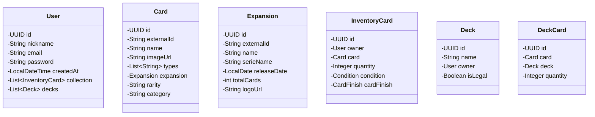

🚀 SilphEngine: Professional TCG Logic Hub

SilphEngine is a high-performance backend system engineered for Pokémon TCG collection management and strategic deck construction. Built on the Spring Boot 4 ecosystem, it serves as a robust "Lab" for players to validate deck legality, track asset conditions, and bridge the gap between physical card ownership and competitive play.

🛠️ Tech Stack (2026 Standard)

    Language: Java 25 (LTS) leveraging Virtual Threads (Project Loom).

    Framework: Spring Boot 4.0.

    Database: PostgreSQL (Relational integrity for complex deck-card mappings).

    Persistence: Spring Data JPA / Hibernate 7.

    External API Integration: TCGdex via Spring WebFlux (Asynchronous ingestion).

  🏛️ Architectural Decisions

    This project prioritizes clean code and system resilience. Key design choices include:

    Dual-ID Strategy: Implementation of internal Surrogate Keys (UUID) for all relational mappings, decoupled from external Business Keys (externalId). This ensures the system remains vendor-agnostic and resilient to third-party API changes.

    Inventory Stacking Logic: Instead of redundant rows, InventoryCard utilizes a quantity-based stacking system filtered by qualitative attributes (Condition, CardFinish).

    Domain Isolation: The card catalog remains immutable. Ownership (Inventory) and Strategy (Decks) are treated as distinct domains, interacting through specific business logic to allow for "theoretical" deck building without physical card requirements.

    Type Safety via Enums: Strategic use of Enums for card finishes and conditions to enforce data integrity and prevent "String-based" errors in the validation engine.

  📊 Class Diagram (UML)  

✨ Core Features

    Advanced Deck Builder: Construct and manage decks with a 60-card limit and 4-copy rule validation.

    Granular Inventory Tracking: Categorize your physical collection by quality (Mint to Poor) and finish (Holo, Reverse-Holo, Normal).

    Silph Importer: An automated synchronization service that enriches basic API data with expansion release dates and series categorization.

    Legality Engine: A rule-based validator to check deck compliance with Standard format.

  🚀 Getting Started
  Prerequisites

    JDK 25

    PostgreSQL 16+

    Maven 3.9+

    Installation

    Clone the repository:
    Bash

    git clone https://github.com/your-username/SilphEngine.git

    Database Setup:
    Create a database named silph_engine and update src/main/resources/application.yml with your credentials.

    Run the Application:
    Bash

    ./mvnw spring-boot:run

    Gemini ha dicho

This README is structured to highlight your engineering mindset. It emphasizes the "Engine" aspect—focusing on logic, validation, and architecture—which is what will catch the eye of a senior recruiter or tech lead.
🚀 SilphEngine: Professional TCG Logic Hub

SilphEngine is a high-performance backend system engineered for Pokémon TCG collection management and strategic deck construction. Built on the Spring Boot 4 ecosystem, it serves as a robust "Lab" for players to validate deck legality, track asset conditions, and bridge the gap between physical card ownership and competitive play.
🛠️ Tech Stack (2026 Standard)

    Language: Java 25 (LTS) leveraging Virtual Threads (Project Loom).

    Framework: Spring Boot 4.0.

    Database: PostgreSQL (Relational integrity for complex deck-card mappings).

    Persistence: Spring Data JPA / Hibernate 7.

    External API Integration: TCGdex via Spring WebFlux (Asynchronous ingestion).

    Documentation: Swagger / OpenAPI 3.1.

🏛️ Architectural Decisions

This project prioritizes clean code and system resilience. Key design choices include:

    Dual-ID Strategy: Implementation of internal Surrogate Keys (UUID) for all relational mappings, decoupled from external Business Keys (externalId). This ensures the system remains vendor-agnostic and resilient to third-party API changes.

    Inventory Stacking Logic: Instead of redundant rows, InventoryCard utilizes a quantity-based stacking system filtered by qualitative attributes (Condition, CardFinish).

    Domain Isolation: The card catalog remains immutable. Ownership (Inventory) and Strategy (Decks) are treated as distinct domains, interacting through specific business logic to allow for "theoretical" deck building without physical card requirements.

    Type Safety via Enums: Strategic use of Enums for card finishes and conditions to enforce data integrity and prevent "String-based" errors in the validation engine.

📊 Class Diagram (UML)
Fragmento de código

%% Paste your Mermaid code here

✨ Core Features

    Advanced Deck Builder: Construct and manage decks with a 60-card limit and 4-copy rule validation.

    Granular Inventory Tracking: Categorize your physical collection by quality (Mint to Poor) and finish (Holo, Reverse-Holo, Normal).

    Silph Importer: An automated synchronization service that enriches basic API data with expansion release dates and series categorization.

    Legality Engine: (In Progress) A rule-based validator to check deck compliance with Standard and Expanded formats.

🚀 Getting Started
Prerequisites

    JDK 25

    PostgreSQL 16+

    Maven 3.9+

Installation

    Clone the repository:
    Bash

    git clone https://github.com/your-username/SilphEngine.git

    Database Setup:
    Create a database named silph_engine and update src/main/resources/application.yml with your credentials.

    Run the Application:
    Bash

    ./mvnw spring-boot:run

📈 Roadmap

    [ ] Core Entity and Repository Layer implementation.

    [ ] WebClient integration for TCGdex data ingestion.

    [ ] Deck legality validation logic (Standard Format).

    [ ] Export functionality for digital TCG simulators.
