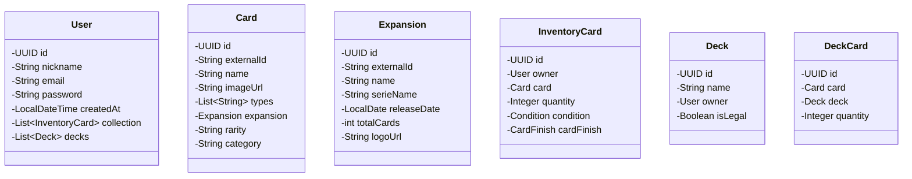

  
  <h1>⚡ SilphEngine</h1>
  
<strong>The High-Performance Logic Engine for TCG Professionals</strong>

  
  
  
  

---

### 📖 Overview

**SilphEngine** is not just another card tracker. It is a backend laboratory engineered to solve the complex logic of **Pokémon TCG**. By decoupling physical ownership from strategic deck building, it provides a robust framework for collection valuation and competitive legality checks.

Built with **Spring Boot 4**, it leverages the latest JVM features like **Virtual Threads** to handle massive data ingestion from external APIs without breaking a sweat.

---

### 🏛️ Architecture Highlights

To achieve a "Senior-Grade" codebase, we implemented the following architectural patterns:

* **🛡️ Surrogate-Business Key Pattern:** Decoupled internal logic from the TCGdex API using `UUID` for internal persistence and `externalId` for API synchronization.
* **📦 Smart Inventory Stacking:** Optimized database footprint by grouping assets by `Condition` and `Finish` using custom Enums.
* **🧩 Domain Isolation:** Separate entity domains for the Global Catalog, User Inventory, and Deck Strategy.

---

### 📊 System Design

